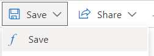

# **Descrição**
Serviço do Azure onde a saída dos logs é feita
# **Notas**
Ainda precisa ser feita a documentação explicando as configurações no Azure
</br>
# **Serviços**
- **Log Analytics**
</br>
# **Como Utilizar**

- Após acessar o recurso, acessar a área de Logs.


- Na área de Logs, preencher os filtros, inserir o script e Executar.


Nota: Atenção com o filtro de data
</br>
# **CustomLogs**

Com intuito de facilitar a utilização dos logs, foi criado uma função customizada chamada CustomLogs

## Como Usar

A função só recebe um parametro de texto, e podem ser aplicados filtros no resultado dela.
Este parametro remete a qualquer texto encontrado dentro da mensagem, como chaves, ids ou partes da mensagem da coluna **LogProperties_data_s**

### Exemplos
```
 //ID de simulação ou analise de credito
CustomLogs("8bfaac6f-3e9a-4a8b-a20e-e99dbf733d17")

//Protocolo
CustomLogs("2195325AS") 

//Retorna todos os inícios de métodos logados
CustomLogs("Begin") 

//Retorna todos os logs com erro
CustomLogs("") | where LogLevel_s contains "Erro" 

//Retorna todos os logs do log AgentsAutbank_CL
CustomLogs("") | where Type contains "AgentsAutbank_CL" 

//Retorna somente logs com erro de integração SOAP
CustomLogs("") | where LogException_InnerException_detail_dadosTEException_s contains "cod" 
```
</br>

## Estrutura Interna


Levando em considerações os Logs criados de forma customizada pelo back-end, segue:
```
//Declaração do método interno
let All = ()
{
    //nome da origem (Se for um log customizado, deve ser executada alguma entrada antes de incluir aqui)
    AgentsCrivo_CL

    //filtro (CustomKeys é o nome de variável de entrada que é configurado ao salvar a função pela primeira vez)
    | where LogMessage_s contains CustomKeys

    //cláusula de união, assim como no SQL
    | union

    //Segue se repetindo para cada Log customizado existente no ambiente
    AgentsAutbank_CL
    | where LogMessage_s contains CustomKeys
};

//Chamada do método
All

//Filtro de "projeção" das colunas, exibindo-as na mesma ordem. (Só serão exibidas colunas com alguma informação dentro do intervalo)
| project 
LogProperties_Timestamp_t, //Hora imprecisa do evento (Defeito nativo do framework)
LogProperties_CurrentStep_d, //Ordem de execução (Garantir que a exibição seguirá a ordem correta)
LogLevel_s, //Trace, Debug, Information, Warning, Error
Type, //Log de origem
LogProperties_SourceContext_s, //Path interno do método
LogProperties_EventId_Name_s, //Id interno de evento, não necessário
LogProperties_data_s, //Json gerado na customização de logs
LogException_Message_s, //Mensagem de exceção
LogException_InnerException_detail_dadosTEException_s, //Erros de xml
LogException_StackTraceString_s,
LogException_InnerException_Message_s,
LogException_InnerException_StackTraceString_s,
LogException_InnerException_InnerException_Message_s,
LogException_InnerException_InnerException_StackTraceString_s

//Ordenação das colunas
| order by 
LogProperties_Timestamp_t desc,
LogProperties_CurrentStep_d desc
```
</br>

## Alteração

1. Acessar a aba de **Functions** e posicionar o mouse em cima do nome **CustomLogs**
 </br>
1. Na modal que vai aparecer, entrar em **Load the function code**
1. O código atual será carregado na área de scripts
 </br>
1. Altera de acordo com a necessidade
1. Em **Save**, aperte **Save**
 </br>
1. Na modal seguinte, não edite nada, simplesmente aperte em **Save** e teste
 </br>
